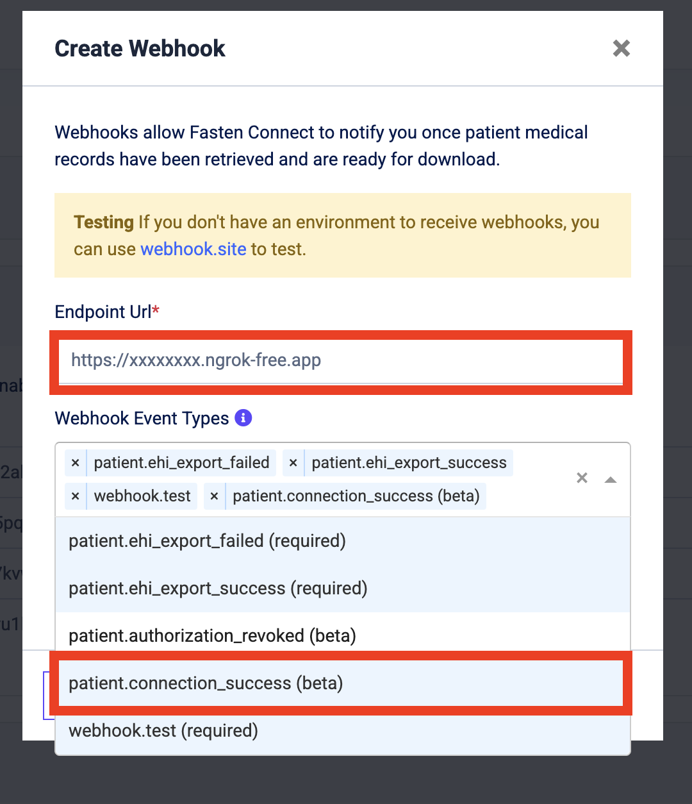

# Fasten Connect — Quickstart

This repo includes minimal Node.js application that will implement  a bulk EHI export flow using Fasten Connect and the Fasten Stitch widget.

1. Render Fasten Stitch widget on the frontend so a patient can link their portal
2. Capture the `org_connection_id` from the Stitch widget event
3. Request a bulk EHI export via the Fasten Connect API
4. Receive a webhook when the export is ready and download the records

> **New to Fasten Connect?**  
> Start with the official Quickstart and API references.  
> Stitch.js component docs are [here](https://docs.connect.fastenhealth.com/stitch/v3/introduction).  
> Webhooks and delivery semantics are [here](https://docs.connect.fastenhealth.com/webhooks/introduction).

---

## Prerequisites

- `Node.js 22` and `npm`
- [ngrok](https://ngrok.com/)
- [Fasten Connect Developer](https://portal.connect.fastenhealth.com/) account
  - Create credentials in the Developer Portal and note your **public** and **private** keys (`test` mode is fine to start)

## 1) Clone and install

```bash
git clone https://github.com/fastenhealth/fasten-connect-quickstart.git
cd fasten-connect-quickstart
npm install
```

## 2) Configure environment

Populate your environment with the following variables. You can create a `.env` file in the root of the project for local development.

```bash
# Your test or live public key (used by Stitch in the browser)
FASTEN_PUBLIC_ID=public_test_xxxxxxxxxxxxxxxxx

# Your test or live private key (used by your server to call the API)
FASTEN_PRIVATE_KEY=private_test_xxxxxxxxxxxxxxxxx
```

> Keys and modes:
> Fasten has test and live modes. Test keys start with `public_test_` and `private_test_`. Live keys start with `public_live_` and `private_live_`. Use test keys while you develop.

## 3) Start the server
```bash

npm start

```

This serves:

- A simple page that includes Stitch (the Fasten widget) with your FASTEN_PUBLIC_ID, so a user can search their health system and sign in
- Minimal endpoints to kick off a patient EHI bulk export and to receive the webhook event when the export is ready
- Stitch renders a button and emits browser events with connection details. You’ll parse those events to get the org_connection_id.

## 4) Start ngrok to expose your local server

```bash
ngrok http 3000

# Note the forwarding URL (e.g. https://xxxxxxxx.ngrok-free.app) and 
# set your Fasten Connect webhook URL to: https://xxxxxxxx.ngrok-free.app/webhook
```

## 5) Configure your Fasten Connect webhook URL
Log in to the [Fasten Connect Developer Portal](https://portal.connect.fastenhealth.com/), find the **Webhooks** section of the **Developer** tab.
Click the "Create Webhook" button, and set your webhook URL to the forwarding URL from ngrok, appending `/webhook`. For example: `https://xxxxxxxx.ngrok-free.app/webhook`.

Make sure to select the `patient.connection_success` event type so the application will be notified when a patient successfully links their portal.



## 6) Test the flow

Open http://localhost:3000 and click the Connect button. Use any of the listed [test credentials](https://docs.connect.fastenhealth.com/quickstart#test-credentials) (Epic, Aetna, VA, etc.) in test mode. 
After sign-in completes, the Fasten service will send a `patient.connection_success` event that contains JSON with the connection metadata, including org_connection_id.

```json
{
    "org_connection_id": "fedec7b7-8cf6-4bc9-9058-72032b426473",
    "endpoint_id": "8e2f5de7-46ac-4067-96ba-5e3f60ad52a4",
    "brand_id": "e16b9952-8885-4905-b2e3-b0f04746ed5c",
    "portal_id": "2727ec27-67e9-475a-bea1-423102beaa1d",
    "connection_status": "authorized",
    "platform_type": "epic"
}
```

The server will use the `org_connection_id` to request a bulk EHI export via the Fasten Connect API. When the export is ready, Fasten will send a webhook to your `/webhook` endpoint with a download URL. The server will log the download URL to the console.

```json
{
  "api_mode": "test",
  "type": "patient.ehi_export_success",
  "date": "2024-04-03T17:16:40Z",
  "id": "1b37cf9b-702f-4fd1-bb00-d0fd8e6dbc89",
  "data": {
    "download_links": [{
      "url": "https://api.connect.fastenhealth.com/v1/bridge/fhir/ehi-export/<id>/download/2024-06-12-6715-4ae4-bde5-ab97519bd1fa.jsonl",
      "export_type": "jsonl",
      "content_type": "application/fhir+ndjson"
    }],
    "task_id": "c9c7a91b66b34fdca749bb8e9cfbf617",
    "org_id": "d65008f6-ffb1-4cd8-b868-c2de66fa5155"
  }
}
```

